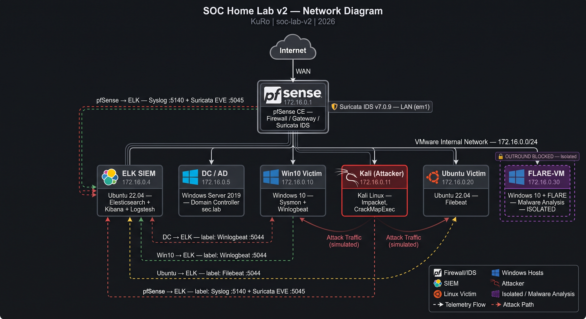

# 🛡️ SOC Home Lab v2

> **Advanced, enterprise-grade SOC lab built for detection engineering, threat hunting, incident response, and malware analysis — not a toy lab.**

---

## Summary

This lab simulates a small Active Directory enterprise environment with a full ELK-based SIEM, network firewall, attacker infrastructure, and an isolated malware analysis workstation. Every incident documented here follows a consistent professional template: attacker perspective, MITRE ATT&CK mapping, detection logic (actual Sigma rules and SIEM queries), sanitized evidence, and an honest gaps/lessons section.

What separates this from a basic home lab:
- Detection content is **versioned and treated like code** (Sysmon config, Sigma rules, Logstash pipelines — all in git)
- Every incident maps explicitly to **MITRE ATT&CK tactics and techniques**
- A documented **threat model** drives which scenarios are built — not a random list
- **Gaps and limitations are acknowledged** — engineering maturity means knowing what you don't catch
- Clean git history with meaningful commits

---

## Architecture

Full details: [`docs/architecture.md`](./docs/architecture.md)

---

## Tech Stack

| Tool | Purpose | Version / Notes |
|------|---------|----------------|
| pfSense | Firewall, gateway, network segmentation | pfSense CE |
| Elasticsearch | Log storage and search | 8.x |
| Kibana | SIEM UI, dashboards, alerting | 8.x |
| Logstash | Log ingestion pipeline | 8.x |
| Sysmon | Host-based telemetry (Windows) | sysmon-modular v4.90 (Olaf Hartong) |
| Winlogbeat | Windows log shipping | 8.x |
| Filebeat | Linux log shipping | 8.x |
| Sigma | Vendor-neutral detection rules | — |
| Suricata | Network IDS/IPS | Planned (v3) |
| FLARE-VM | Malware analysis workstation | Isolated, no telemetry to SIEM |
| Active Directory | Target enterprise environment | soc.lab domain |
| Kali Linux | Attacker simulation | Rolling |

---

## Incident Index

| ID | Name | MITRE Tactic | Technique | Status |
|----|------|-------------|-----------|--------|
| INC-001 | LLMNR Poisoning + NTLM Relay | Credential Access | T1557.001 | 🔲 Planned |
| INC-002 | AS-REP Roasting | Credential Access | T1558.004 | ✅ Complete |
| INC-003 | Kerberoasting | Credential Access | T1558.003 | ✅ Complete |
| INC-004 | Pass-the-Hash Lateral Movement | Lateral Movement | T1550.002 | ✅ Complete |
| INC-005 | DCSync Attack | Credential Access | T1003.006 | ✅ Complete |
| INC-006 | Malware Detonation + C2 Beacon | Execution / C2 | T1204, T1071 | 🔲 Planned |
| INC-007 | Phishing → Macro → PowerShell | Initial Access | T1566.001, T1059.005 | 🔲 Planned |

---

## Skills Demonstrated

| Competency | How It Shows Up |
|------------|----------------|
| Detection Engineering | Sigma rules, Sysmon tuning, Kibana alerts |
| Threat Hunting | KQL/EQL queries, log correlation across hosts |
| SIEM Administration | ELK deployment, index management, pipeline config |
| AD Security | Domain attacks simulated and detected end-to-end |
| Incident Response | Per-incident timelines, containment steps, IOC extraction |
| Malware Analysis | FLARE-VM static + dynamic analysis workflow |
| Network Security | pfSense rules, network segmentation, IDS (Suricata — planned) |

---

## How to Reproduce

See [`docs/build-guide.md`](./docs/build-guide.md) for full step-by-step deployment.

---

## Status

See [`STATUS.md`](./STATUS.md) for what's verified, what's in progress, and what's planned next.

---

## Connect

Built by **KuRo** — Detection Engineer focused on ELK-based SOC builds, Sigma rules, and MITRE ATT&CK-aligned detection pipelines.

Open to remote contractor opportunities with MSSPs and SOC teams.

🔗 [GitHub](https://github.com/KuRo0x) · 💼 [LinkedIn](https://www.linkedin.com/in/walid-ait-zaouit/)

---

*MIT License · 2026*
