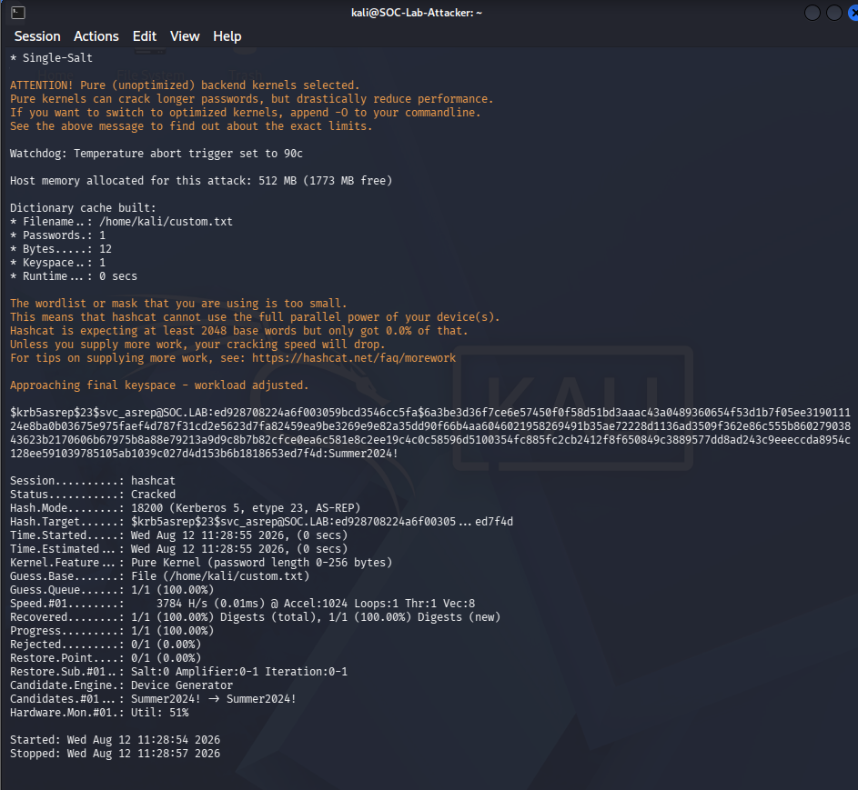

# INC-002 — AS-REP Roasting

> **Status:** ✅ Complete  
> **Date:** 2026-08-12  
> **MITRE ATT&CK:** [T1558.004 — Steal or Forge Kerberos Tickets: AS-REP Roasting](https://attack.mitre.org/techniques/T1558/004/)  
> **Tactic:** Credential Access  
> **Severity:** High  

---

## Summary

An attacker identified a domain account (`svc_asrep`) with Kerberos pre-authentication disabled (`DoesNotRequirePreAuth = true`). Without requiring any credentials, the attacker requested an AS-REP ticket from the domain controller. The ticket — encrypted with the account's password hash using RC4 — was captured offline and cracked with Hashcat in under 3 seconds using a custom wordlist.

The domain controller generated Security Event ID `4768` with `TicketEncryptionType: 0x17` (RC4) and `PreAuthType: 0`, which was ingested into ELK and confirmed as the primary detection signal.

---

## Environment

| Component | Value |
|-----------|-------|
| Domain | `SOC.LAB` |
| Domain Controller | `SOC-Lab-DC` / `172.16.0.5` |
| Attacker (Kali) | `172.16.0.11` |
| Vulnerable account | `svc_asrep@SOC.LAB` |
| Pre-auth setting | `DoesNotRequirePreAuth = true` |
| Attack tool | Impacket `GetNPUsers.py` |
| Crack tool | Hashcat `-m 18200` |

---

## What Is AS-REP Roasting?

AS-REP Roasting targets Active Directory accounts that have **Kerberos pre-authentication disabled**. Normally, a client must prove its identity before the KDC issues a Ticket Granting Ticket (TGT). When pre-auth is disabled, the KDC returns an AS-REP response encrypted with the user's password hash — **without requiring any authentication**. An attacker can request this for any vulnerable account and crack the hash offline.

```
Kali (attacker)
  └─ GetNPUsers.py → DC (172.16.0.5)
       └─ AS-REP returned (no auth required)
            └─ $krb5asrep$23$ hash captured
                 └─ Hashcat -m 18200 → password cracked offline
```

---

## Prerequisites

| Requirement | Detail | Status |
|-------------|--------|--------|
| Vulnerable AD user | `svc_asrep` — `DoesNotRequirePreAuth = true` | ✅ |
| Kerberos audit policy | `Success and Failure` on DC | ✅ |
| Winlogbeat Security channel | Shipping Event ID 4768 to ELK | ✅ |
| Clock skew < 5 min | Chrony on Kali synced to DC | ✅ |

---

## Attack Walkthrough

### 1. Enumerate and Capture AS-REP Hash (Kali)

```bash
echo "svc_asrep" > /home/kali/users.txt
impacket-GetNPUsers SOC.LAB/ -usersfile /home/kali/users.txt -no-pass \
  -dc-ip 172.16.0.5 -outputfile /home/kali/asrep_hashes.txt -format hashcat
```

**Result:** Hash captured for `svc_asrep@SOC.LAB`.


### 2. Crack the Hash Offline

```bash
hashcat -m 18200 /home/kali/asrep_hashes.txt /home/kali/custom.txt --force
```

**Result:** `Status: Cracked` — password recovered in 3 seconds.



> Hash mode 18200 = Kerberos 5, etype 23, AS-REP. RC4 (etype 0x17) is weak by design — legacy compatibility.

---

## Detection

See [`detection.md`](./detection.md) for full KQL query, Sigma rule, and validation status.

### Primary Signal — Event ID 4768

| ELK Field | Value | Significance |
|-----------|-------|--------------|
| `event.code` | `4768` | Kerberos TGT request |
| `winlog.event_data.TicketEncryptionType` | `0x17` | RC4 — legacy, crackable |
| `winlog.event_data.PreAuthType` | `0` | Pre-auth disabled — AS-REP roastable |
| `winlog.event_data.TargetUserName` | `svc_asrep` | Targeted account |
| `winlog.event_data.IpAddress` | `::ffff:172.16.0.11` | Kali attacker IP |
| `host.name` | `soc-lab-dc` | Domain Controller |
| `@timestamp` | `Aug 12, 2026 @ 08:23:43` | Time of attack |

**Result:** 2 documents — both attack runs captured.


---

## Evidence Index

| # | Type | Description | Sensitive? |
|---|------|-------------|------------|
| 1 | Windows Event | EID 4768 — TGT request, `PreAuthType: 0`, `EncType: 0x17` | No |
| 2 | Screenshot | `01-asrep-hash-captured.png` — Impacket hash capture | No |
| 3 | Screenshot | `02-hashcat-cracked.png` — Hashcat cracked output | No |
| 4 | Screenshot | `03-kibana-4768-detection.png` — Kibana query hit | No |
| 5 | Screenshot | `04-elk-event-fields.png` — ELK expanded event | No |
| 6 | Raw hash | `$krb5asrep$23$svc_asrep` | **Yes — local only** |
| 7 | Cracked credential | Plaintext password | **Yes — local only** |

> Sensitive artefacts remain on the isolated Kali host and are excluded from version control via `.gitignore`.

---

## Indicators of Compromise

| Type | Value |
|------|-------|
| Account | `svc_asrep@SOC.LAB` |
| Attacker IP | `172.16.0.11` |
| Hash prefix | `$krb5asrep$23$` |
| Encryption type | `0x17` (RC4) |
| Pre-auth type | `0` (disabled) |
| Event ID | `4768` |

See also [`threat-scenarios/INC-002-asrep-roasting/iocs.md`](../../threat-scenarios/INC-002-asrep-roasting/iocs.md)

---

## Remediation

See [`remediation.md`](./remediation.md) for full impact statement and control changes.

| Control | Action |
|---------|--------|
| **Enforce Pre-Auth** | Audit all accounts: `Get-ADUser -Filter {DoesNotRequirePreAuth -eq $true}` — enable pre-auth on all |
| **Disable RC4** | GPO → `Network security: Configure encryption types allowed for Kerberos` → uncheck RC4 |
| **Use gMSA** | Replace service accounts with Group Managed Service Accounts — passwords auto-rotated, 120+ chars |
| **Alert on 4768 + 0x17** | Sigma rule deployed — alert on any TGT request using RC4 encryption |
| **Privileged account audit** | Any service account with sensitive access must have pre-auth enforced |

---

## References

- [MITRE ATT&CK T1558.004](https://attack.mitre.org/techniques/T1558/004/)
- [Harmj0y — Roasting AS-REPs](http://www.harmj0y.net/blog/activedirectory/roasting-as-reps/)
- [Impacket GetNPUsers](https://github.com/fortra/impacket/blob/master/examples/GetNPUsers.py)
- [Microsoft EID 4768 Documentation](https://learn.microsoft.com/en-us/windows/security/threat-protection/auditing/event-4768)

---

> **Red-team perspective (attack commands, prerequisites, tool setup):**  
> See [`threat-scenarios/INC-002-asrep-roasting/`](../../threat-scenarios/INC-002-asrep-roasting/README.md)
